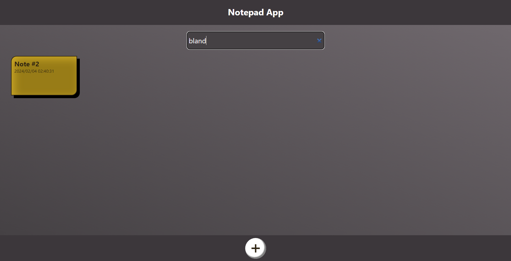

# Notepad App

A notepad web app, made for taking notes (and maybe lists). The project is full TypeScript: the backend is built with Nodejs + Express, while the frontend is made with React. Due to its simplicity, there is no connection with any database: instead, it's a single json file containing all notes and their info. Also, there is no authentication/authorization system.

#### Examples

-   PC:

-   Mobile:

## Contributing

Issues and pull requests are accepted and appreciated!

## Usage

This repository will be hosted at Github Pages soon.

## Author

#### João Vitor Sobral

Github: sobraljvss  
Contact: sobraljvss@gmail.com
